# SPlot

SPlot is Scala library for data visualization.

# Goals

- Provide simple API in Scala for data visualization similar to ggplot (http://ggplot2.org/) and Seaborn (https://seaborn.pydata.org/)
- Support exploratory data analysis

Currently project is **NOT** focused on:

- Performance
- Rich possibilities for customization

# Getting started

Include dependency:

```scala
"com.github.piotr-kalanski" % "splot" % "0.2.0"
```

or

```xml
<dependency>
    <groupId>com.github.piotr-kalanski</groupId>
    <artifactId>splot</artifactId>
    <version>0.2.0</version>
</dependency>
```

Import implicits, which adds methods to Scala collection enabling plotting:
```scala
import com.datawizards.splot.api.implicits._
```

# Basic example

To plot bar chart using Scala sequence you need to call one method:
```scala
import com.datawizards.splot.api.implicits._

Seq(1.0, 4.0, 9.0).plotBar()
```


# Supported charts

- [Bar](##Bar)
- [Scatter](##Scatter)
- [Line](##Line)
- [Histogram](##Histogram)
- [Bubble](##Bubble)
- [Pie](##Pie)

> Please note that all below examples **require** importing:

```scala
import com.datawizards.splot.api.implicits._
```

> Please also note that most of below examples are based on randomly generated data!

## Bar

### Bar chart for sequence of numbers

```scala
val data = Seq(1.0, 4.0, 9.0)
data.plotBar()
```

### Bar chart for sequence of case class

```scala
case class Person(name: String, age: Int)

val data = Seq(
    Person("p1", 45),
    Person("p2", 85),
    Person("p3", 78)
)

data.plotBar(_.age)
```


### Bar chart for categorical data

```scala
val populationByCountry = Seq(
    ("DE", 81),
    ("TR", 72),
    ("FR", 63),
    ("UK", 62),
    ("IT", 61),
    ("ES", 46),
    ("UA", 45),
    ("PL", 38),
    ("RO", 19),
    ("NL", 17),
    ("GR", 11),
    ("PT", 11),
    ("BE", 10),
    ("CZ", 10),
    ("HU", 10)
  )

populationByCountry
    .buildPlot()
    .bar(_._1, _._2)
    .titles("Population by country [millions]", "Country", "Population")
    .size(1200, 300)
    .legendVisible(false)
    .display()
```


## Scatter

### Scatter chart for sequence of numbers

```scala
val data = Seq(
    (1.0, 1.0),
    (2.0, 4.0),
    (3.0, 9.0)
)

data.plotScatter()
```


### Scatter chart for sequence of case class

```scala
case class AgeIncome(age: Int, income: Double)

val data = Seq(
    AgeIncome(20, 1000.0),
    AgeIncome(25, 2000.0),
    AgeIncome(30, 2500.0),
    AgeIncome(35, 3000.0),
    AgeIncome(40, 3500.0),
    AgeIncome(45, 3000.0),
    AgeIncome(50, 2500.0)
)

data.plotScatter(_.age, _.income)
```

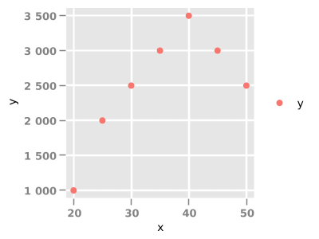

## Line

### Line chart for sequence of numbers

```scala
val data = Seq(
    (1.0, 1.0),
    (2.0, 4.0),
    (3.0, 9.0)
)

data.plotLine()
```

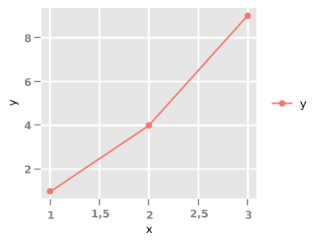

### Line chart for sequence of case class

```scala
case class AgeIncome(age: Int, income: Double)

val data = Seq(
    AgeIncome(20, 1000.0),
    AgeIncome(25, 2000.0),
    AgeIncome(30, 2500.0),
    AgeIncome(35, 3000.0),
    AgeIncome(40, 3500.0),
    AgeIncome(45, 3000.0),
    AgeIncome(50, 2500.0)
)

data.plotLine(_.age, _.income)
```

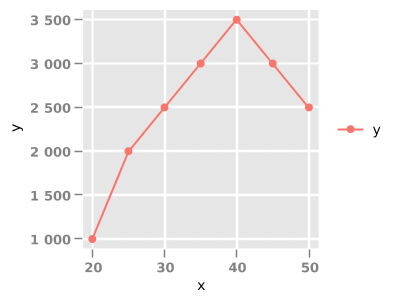

### Line chart for timeseries data

```scala
timeseriesData2017.plotLine()
```

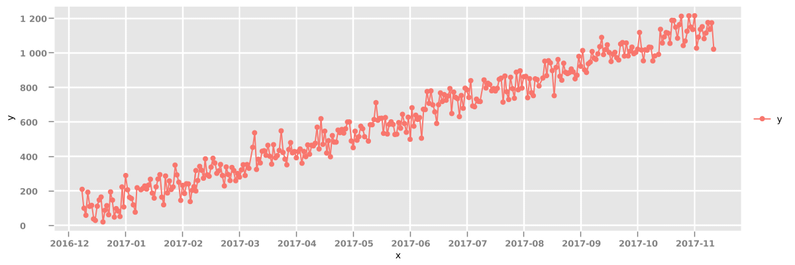

## Histogram

### Histogram for sequence of numbers

```scala
val rand = new Random()
val gaussians = for(i <- 1 to 10000) yield rand.nextGaussian()
gaussians.plotHistogram(100)
```


### Histogram for categorical data

```scala
people
    .buildPlot()
    .histogramForCategories(_.education)
    .size(400, 300)
    .titles("People by education", "Education", "Count")
    .legendVisible(false)
    .display()
```

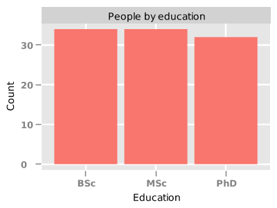

## Bubble chart

```scala
  Seq(
    (1, 1, 9.0),
    (1, 2, 40.0),
    (3, 2, 60.0),
    (2, 2, 90.0),
    (1, 3, 30.0),
    (2, 3, 40.0)
  )
  .buildPlot()
  .bubble(_._1, _._2, _._3)
  .display()
```


## Pie

```scala
Seq(
    ("DE", 81),
    ("TR", 72),
    ("FR", 63),
    ("UK", 62),
    ("IT", 61)
  )
  .buildPlot()
  .pie()
  .display()
```

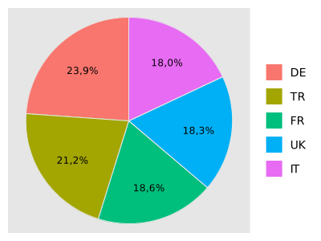

# Multiple series

```scala
people
    .buildPlot()
    .scatter(_.age, _.income)
    .seriesBy(_.education)
    .size(500, 400)
    .titles("Age and income by education", "age", "income")
    .display()
```

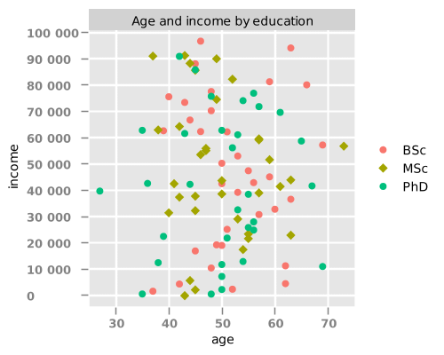

# Multiple charts

## Grouping by cols

### Scatter plot

```scala
people
    .buildPlot()
    .scatter(_.age, _.income)
    .colsBy(_.country)
    .display()
```


### Histogram

```scala
people
    .buildPlot()
    .colsBy(_.education)
    .histogram(_.age, 50)
    .size(1200, 400)
    .display()
```

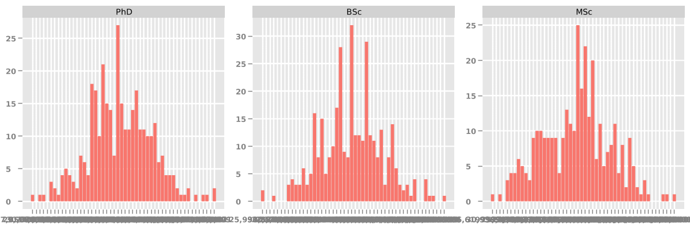

## Grouping by rows

```scala
people
    .buildPlot()
    .scatter(_.age, _.income)
    .rowsBy(_.education)
    .display()
```


## Grouping by cols and/or rows

### Scatter plot

```scala
people
    .buildPlot()
    .scatter(_.age, _.income)
    .colsBy(_.country)
    .rowsBy(_.education)
    .display()
```

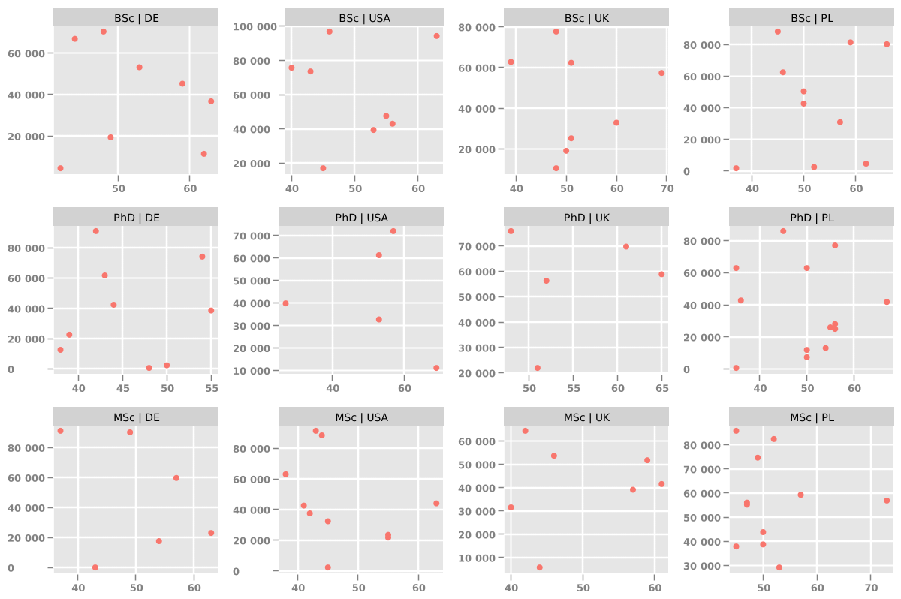

### Bar plot

```scala
val groupedPeopleByCountryEducation = people
    .groupBy(p => (p.country, p.education))
    .mapValues(pv => pv.size)

groupedPeopleByCountryEducation
    .buildPlot()
    .colsBy(_._1._1)
    .bar(x => x._1._2, x => x._2)
    .size(1200, 300)
    .display()
```


## Multiple columns and series

```scala
people
    .buildPlot()
    .scatter(_.age, _.income)
    .size(1200, 300)
    .colsBy(_.country)
    .seriesBy(_.education)
    .display()
```


# Aggregation functions

SPlot enables aggregating your data before displaying chart.

Currently supported aggregation functions:

- count
- mean
- sum

## Calculating count

```scala
  people
    .buildPlot()
    .barWithAggregations(_.education, count())
```

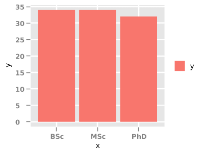

## Calculating mean

```scala
  people
    .buildPlot()
    .barWithAggregations(_.country, mean(_.income))
```

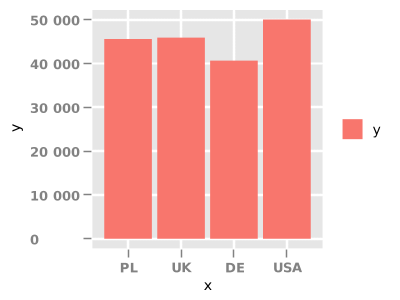

# Saving plot to file

To save plot to file you need to call method *save()* instead of calling *display()*.

```scala
import com.datawizards.splot.model.ImageFormats

Seq(1.0, 4.0, 9.0)
    .buildPlot()
    .bar()
    .save("chart.png", ImageFormats.PNG)
```

Currently supported image formats:

- BMP
- PNG
- JPG
- GIF
- EPS
- PDF
- SVG

# Customizations

## Change chart title

```scala
val data = Seq(1.0, 4.0, 9.0)

data
    .buildPlot()
    .bar()
    .titles("Example bar chart", "x values", "y values")
    .display()
```

## Change chart size (width, height)

```scala
val data = Seq(1.0, 4.0, 9.0)

data
    .buildPlot()
    .bar()
    .size(1600, 1200)
    .display()
```

## Change series name

```scala
Seq(1.0, 4.0, 9.0)
    .buildPlot()
    .bar()
    .seriesName("custom name")
    .display()
```


## Hide legend

```scala
Seq(1.0, 4.0, 9.0)
    .buildPlot()
    .bar()
    .legendVisible(false)
    .display()
```

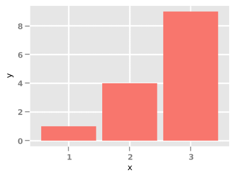

## Chart themes

Currently supported themes:

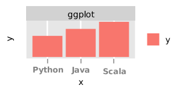  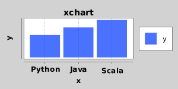 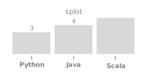

To change theme you need to call method *theme()*:

```scala
data
    .buildPlot()
    .bar()
    .theme(PlotTheme.GGPlot2)
    .display()
```

# Bugs

Please report any bugs or submit feature requests to [SPlot Github issue tracker](https://github.com/piotr-kalanski/SPlot/issues).

# Continuous Integration

[](https://api.travis-ci.org/piotr-kalanski/SPlot.png?branch=development)

[Build History](https://travis-ci.org/piotr-kalanski/SPlot/builds)

# Code coverage

[](http://codecov.io/github/piotr-kalanski/SPlot/coverage.svg?branch=development)

# Credits

| Library | Category | License |
| ------- | -------- | ------- |
| [XChart](https://github.com/timmolter/XChart) | Graphing | [Apache 2.0](http://www.apache.org/licenses/LICENSE-2.0) |

# Contact

piotr.kalanski@gmail.com